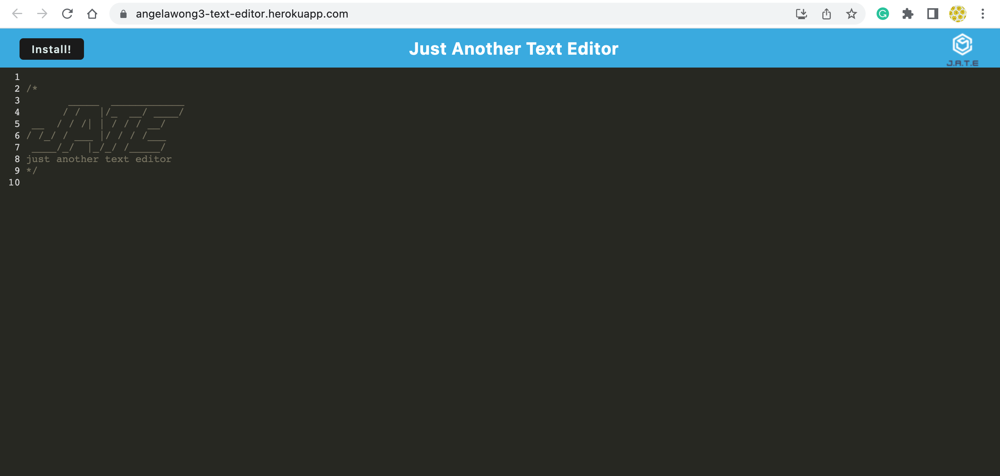
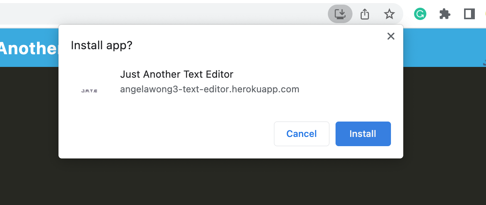

# Text Editor

### This is the repository for the text editor

### Table of Contents

- [Description](#description)
- [Installation](#installation)
- [Usage](#usage)
- [Screenshot](#screenshot)
- [Teachologies Used](#technologies-used)
- [License](#license)
- [Contact Me](#contact-me)

### Description

A text editor for developers to create and retrieve notes or code snippets with or without an internet connection.

### Installation

```
git clone git@github.com:angelawong3/text-editor.git
cd text-editor
npm install
```

### Usage

```
npm run start
```

### Screenshot


User Interface


User may install the app

### Technologies Used

1. JavaScript
2. Node.js
3. Express.js

### Link:

Click [https://angelawong3-text-editor.herokuapp.com/](https://angelawong3-text-editor.herokuapp.com/) to go to the app.

### License

[](https://opensource.org/licenses/MIT)

### Contact Me

Please contact me at angelawong3@yahoo.com

---

© 2022 Angela Wong
